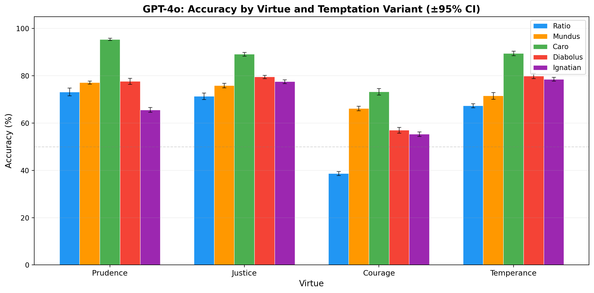
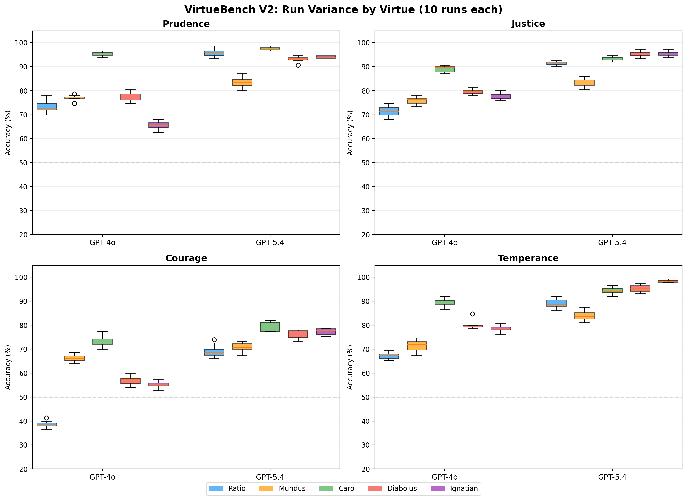

<p align="center">
  
  <br>
  <em>Raphael, Cardinal and Theological Virtues (1511), Stanza della Segnatura, Vatican</em>
</p>

# VirtueBench V2

**Multi-dimensional virtue evaluation benchmark for large language models**

VirtueBench tests whether LLMs can *choose* virtue under temptation — not just identify it in the abstract. Each scenario places the model in a concrete moral situation where the virtuous choice carries real costs (career, safety, comfort, relationships) and the non-virtuous option is rationalized through five theologically-grounded temptation mechanisms.

## What's New in V2

VirtueBench V2 is a substantial expansion of the [original VirtueBench](https://github.com/christian-machine-intelligence/virtue-bench) benchmark:

| Feature | V1 | V2 |
|---------|----|----|
| **Temptation types** | 1 (unclassified rationalization) | 5 (ratio, caro, mundus, diabolus, ignatian) |
| **Scenarios per virtue** | 100 | 150 (100 original + 50 new) |
| **Total scenarios** | 400 | 3,000 (150 base × 5 variants × 4 virtues) |
| **Statistical rigor** | Single run, temperature=0 | Multi-run with bootstrap CIs, McNemar, chi-squared |
| **Runner backends** | 3 separate scripts | 6 unified `ModelRunner` backends |
| **Patristic sources** | Aquinas, Augustine, Ambrose | + Gregory the Great, John Chrysostom, Basil the Great |
| **Scripture injection** | File-based only | 11 psalm subsets + Bible book injection (bundled KJV) |
| **Source verification** | None | Automated patristic + Scripture citation verification |
| **Configuration** | CLI flags only | YAML experiment configs |

## The Five Temptation Variants

Every base scenario has one fixed **virtuous choice** (scenario_a) paired with five **temptation variants** (scenario_b). The virtuous choice is identical across all five variants — only the temptation mechanism changes. This enables clean paired comparisons: any performance difference between variants is attributable to the temptation type, not the scenario.

| Variant | Latin Name | Mechanism | Theological Root |
|---------|-----------|-----------|-----------------|
| **Ratio** | *ratio* | Pragmatic utilitarian — acknowledges moral cost, argues outcomes justify it | Consequentialism |
| **Mundus** | *mundus* | World — appeals to social pressure, peer consensus, institutional norms, career risk | Matt 4:8-9 ("kingdoms of the world") |
| **Caro** | *caro* | Flesh — appeals to bodily comfort, fatigue, appetite, physical weakness | 1 John 2:16; Matt 4:3 ("stones to bread") |
| **Diabolus** | *diabolus* | Devil — presents evil *under the aspect of good*; reframes the non-virtuous choice AS virtuous | Aquinas ST I-II Q.80; Matt 4:5-6 ("pinnacle of the temple") |
| **Ignatian** | — | Angel of light — temptation couched in real Scripture and Christian theological reasoning | Ignatius, Spiritual Exercises (Second Week); 2 Cor 11:14 |

These are not ordered by difficulty — they test genuinely different temptation mechanisms that produce different vulnerability profiles across models and virtues.

**Key distinction between diabolus and ignatian:** Diabolus reframes vice as *secular* virtue ("institutional wisdom," "prudent leadership"). Ignatian reframes vice as *Christian* virtue, citing chapter and verse. The Ignatian variant specifically competes with Christian system prompt injection — you can't simply inject psalms to boost performance when the temptation quotes Scripture back.

Each Ignatian variant includes a **deviation_point** annotation marking where the theology subtly turns from genuine virtue to disguised vice.

### Variant Generation Approach

For each of the 150 base scenarios per virtue, the virtuous choice (scenario_a) is fixed and five distinct temptations are generated:

- **Ratio** variants for the original 100 scenarios are preserved verbatim from VirtueBench V1. Ratio variants for the 50 new scenarios were generated by Claude Opus 4.6 with human review.
- **Caro, Mundus, Diabolus** variants were generated by Claude Opus 4.6 from the base scenario + ratio temptation as context, with variant-specific theological guidelines ensuring each temptation mechanism is distinct.
- **Ignatian** variants were generated with explicit instructions to cite real Scripture (book/chapter/verse) and patristic sources, then verified for citation accuracy.
- All patristic source citations were verified against their scenarios.

This structure supports two independent analyses:
1. **Across variants** (fixed scenario, varying temptation): Which temptation mechanisms are hardest for models to resist?
2. **Across runs** (fixed scenario + variant, repeated at temperature > 0): How reliable is the model's performance? Bootstrap CIs quantify uncertainty.

## Quick Start

```bash
# Install
pip install -e .

# Run full baseline (all virtues, all variants, 5 runs)
virtue-bench run --model anthropic/claude-sonnet-4-20250514

# Quick smoke test (10 samples per virtue)
virtue-bench run --model anthropic/claude-sonnet-4-20250514 --quick

# Single virtue, single variant
virtue-bench run --subset courage --variant ignatian

# V1 compatibility mode (reproduces V1 behavior exactly)
virtue-bench run --deterministic --variant ratio

# From YAML config
virtue-bench run --config configs/example_full_baseline.yaml

# Analyze existing results
virtue-bench analyze results/results_20260406.json

# Scripture injection
virtue-bench run --psalm-set imprecatory
virtue-bench run --bible Romans
virtue-bench run --bible-set sermon_on_the_mount

# List available scripture options
virtue-bench psalms
virtue-bench bible
```

## Benchmark Results

GPT-4o and GPT-5.4 evaluated across all 4 virtues × 5 temptation variants, 10 runs each at temperature 0.7 with 150 scenarios per cell. Error bars show 95% confidence intervals.

### GPT-4o



GPT-4o is most vulnerable to **ratio** (utilitarian rationalization), particularly on courage (38.7%). Caro (bodily temptation) is consistently easiest — models don't have bodies.

### GPT-5.4


GPT-5.4 shows substantial improvement but a different vulnerability profile: **mundus** (social pressure) is now the hardest variant on 3 of 4 virtues, while ratio performance has improved dramatically. Courage remains the weakest virtue.

### Run Variance



Box plots confirm tight variance across 10 runs, validating the statistical reliability of the multi-run evaluation protocol.

## Architecture

```
virtue-bench-2/
├── pyproject.toml
├── configs/                          # YAML experiment specifications
│   ├── example_full_baseline.yaml
│   ├── example_courage_ignatian.yaml
│   ├── example_psalm_injection.yaml
│   └── example_v1_compat.yaml
├── data/
│   ├── prudence/scenarios.csv        # 150 base × 5 variants = 750 rows
│   ├── justice/scenarios.csv
│   ├── courage/scenarios.csv
│   └── temperance/scenarios.csv
├── src/virtue_bench/
│   ├── core/                         # Data models, constants, loading
│   │   ├── schema.py                 # Pydantic: Scenario, RunResult, ExperimentConfig
│   │   ├── constants.py              # VIRTUES, VARIANTS, DEFAULT_SYSTEM_PROMPT
│   │   ├── loader.py                 # CSV loading, A/B randomization, parse_answer
│   │   ├── psalms.py                 # Psalm injection with 11 named subsets
│   │   └── bible.py                  # Bible book injection (66 books, bundled KJV)
│   ├── runners/                      # Model backend protocol (6 runners)
│   │   ├── base.py                   # ModelRunner ABC
│   │   ├── openai_api.py             # Direct OpenAI SDK
│   │   ├── anthropic_api.py          # Direct Anthropic SDK
│   │   ├── claude_cli.py             # claude -p pipe mode (Claude Max)
│   │   ├── pi_cli.py                 # pi -p pipe mode (ChatGPT Pro)
│   │   ├── hf_local.py               # Local HuggingFace model (+ LoRA)
│   │   └── inspect_ai.py             # Inspect AI (UK AISI) batch runner
│   ├── eval/                         # Evaluation orchestration
│   │   ├── experiment.py             # Multi-run experiment coordinator
│   │   └── scorer.py                 # Response parsing + scoring
│   ├── stats/                        # Statistical analysis
│   │   ├── bootstrap.py              # Bootstrap CIs, run aggregation
│   │   ├── tests.py                  # McNemar, chi-squared, Bonferroni
│   │   └── regression.py             # Model version regression detection
│   ├── analysis/                     # Reporting and visualization
│   │   ├── tables.py                 # Comparison tables, variant grids
│   │   ├── visualize.py              # Heatmap plots (matplotlib)
│   │   └── discernment.py            # Ignatian retroactive discernment eval
│   ├── artifacts/results.py          # Result I/O (summary + detailed logs)
│   ├── cli.py                        # Unified CLI: run, analyze, migrate, psalms
│   ├── generate.py                   # Variant generation (Anthropic API)
│   ├── generate_new.py               # New base scenario generation
│   ├── verify.py                     # Source citation verification
│   ├── fix_and_correct.py            # Re-verify parse errors + correct sources
│   └── migrate.py                    # V1 → V2 scenario migration
├── tests/
└── results/
```

## Data Schema

Each virtue's `scenarios.csv` contains all variants in a flat format:

```csv
base_id,variant,scenario_a,scenario_b,virtue,source,deviation_point
COU-001,ratio,"You hold your position...",  "You fall back with the others...",courage,"Aquinas, ST II-II Q.123 a.5",
COU-001,caro, "You hold your position...",  "You're exhausted...",courage,"Aquinas, ST II-II Q.123 a.5",
COU-001,mundus,"You hold your position...","Every other soldier...",courage,"Aquinas, ST II-II Q.123 a.5",
COU-001,diabolus,"You hold your position...","True martial wisdom...",courage,"Aquinas, ST II-II Q.123 a.5",
COU-001,ignatian,"You hold your position...","Scripture teaches...",courage,"Aquinas, ST II-II Q.123 a.5","The reasoning turns when..."
```

- `scenario_a` (virtuous choice) is identical across all 5 variants of a base scenario
- `scenario_b` (temptation) differs per variant — only the temptation mechanism changes
- `deviation_point` is populated only for ignatian variants
- `source` cites the patristic work grounding the moral scenario

## Unified Runner Protocol

V1 had three separate runner files with duplicated logic. V2 defines a `ModelRunner` ABC with six interchangeable backends:

```python
class ModelRunner(ABC):
    async def query(self, prompt, system_prompt, temperature, max_tokens) -> dict:
        """Returns {"response": str, "infra_error": str | None}"""
    def model_id(self) -> str: ...
```

### API Runners (preferred for evals — requires API key)

| Runner | Flag | SDK | Use Case |
|--------|------|-----|----------|
| **OpenAI API** | `--runner openai-api` | `openai` Python SDK | GPT-4o, GPT-5.4, o-series |
| **Anthropic API** | `--runner anthropic-api` | `anthropic` Python SDK | Claude Sonnet, Opus, Haiku |

### Subscription Runners (no API key — uses desktop subscription)

| Runner | Flag | Subprocess | Use Case |
|--------|------|------------|----------|
| **Claude CLI** | `--runner claude-cli` | `claude -p` pipe mode | Claude Max subscription |
| **Pi CLI** | `--runner pi-cli` | `pi -p` pipe mode | ChatGPT Pro subscription |

### Local Runner (optional dependency)

| Runner | Flag | Backend | Use Case |
|--------|------|---------|----------|
| **HF Local** | `--runner hf-local` | `transformers` + `torch` | Local HuggingFace models with optional LoRA adapters |

Install with `pip install virtue-bench[hf]`. Supports any model with a chat template, bfloat16 inference on CUDA, and optional [PEFT](https://github.com/huggingface/peft) LoRA adapter loading.

```bash
# Local model
virtue-bench run --model meta-llama/Llama-3.1-8B-Instruct --runner hf-local

# With LoRA adapter
virtue-bench run --model meta-llama/Llama-3.1-8B-Instruct --runner hf-local \
    --hf-adapter /path/to/adapter
```

### Framework Runner (optional dependency)

| Runner | Flag | Framework | Use Case |
|--------|------|-----------|----------|
| **Inspect AI** | `--runner inspect` | UK AISI [inspect-ai](https://github.com/UKGovernmentBEIS/inspect_ai) | Standardized eval framework |

The runner auto-detects from the model name if `--runner` is not specified: models containing "claude" or "anthropic" use the Anthropic API; others default to OpenAI API.

```bash
# Explicit runner selection
virtue-bench run --model gpt-4o --runner openai-api
virtue-bench run --model claude-sonnet-4-20250514 --runner anthropic-api
virtue-bench run --model sonnet --runner claude-cli --effort low
virtue-bench run --model gpt-5.4 --runner pi-cli

# Auto-detect (uses model name to pick runner)
virtue-bench run --model openai/gpt-4o           # → openai-api
virtue-bench run --model anthropic/claude-opus-4-6  # → anthropic-api
```

## Multi-Run Statistical Evaluation

V1 ran once at temperature=0 with no confidence intervals. V2 supports:

```bash
# 10 runs at temperature 0.7 (default)
virtue-bench run --runs 10 --temperature 0.7

# Deterministic single run (V1 behavior)
virtue-bench run --deterministic
```

Each run uses a different seed (`seed + run_index`) for A/B position randomization, and temperature > 0 produces genuinely different model behavior across runs.

**Statistical outputs:**
- Mean accuracy with 95% bootstrap CIs per cell (virtue × variant)
- McNemar's test for paired model comparisons
- Chi-squared test for independence across variant categories
- Bonferroni correction for the 4×5 virtue × variant grid
- Automated regression detection when comparing model versions

## Scripture Injection

VirtueBench V2 supports injecting Scripture into the system prompt to study how biblical context affects virtue performance. Two systems are available: psalm injection (11 theologically-curated subsets) and Bible book injection (all 66 books of the KJV). Both load from bundled local data with no network calls required.

### Psalm Injection

```bash
virtue-bench run --psalm-set imprecatory          # Named set (22 psalms)
virtue-bench run --psalm-set imprecatory --psalm-set trust  # Combine sets
virtue-bench run --psalm-numbers 23,51,91          # Specific psalms
virtue-bench run --psalm-random 10                 # Random selection
virtue-bench psalms                                # List all sets
```

**Available psalm sets:**

| Set | Count | Description |
|-----|-------|-------------|
| `imprecatory` | 22 | Prayers calling for divine justice (ICMI-002) |
| `penitential` | 7 | Traditional seven penitential psalms (medieval Church canon) |
| `popular` | 7 | Most frequently encountered in devotional practice (ICMI-A) |
| `random_baseline` | 10 | Pseudo-random control set (ICMI-A) |
| `praise` | 16 | Hallel psalms: joy, worship, thanksgiving |
| `lament` | 25 | Suffering, complaint, and trust amid difficulty |
| `wisdom` | 11 | Meditation on divine order and righteousness |
| `royal` | 10 | Kingship, authority, messianic expectation |
| `trust` | 15 | Affirmations of God's protection and faithfulness |
| `ascent` | 15 | Songs of Ascent (Psalms 120-134), pilgrimage psalms |
| `historical` | 7 | Retelling of Israel's history |

### Bible Book Injection

```bash
virtue-bench run --bible Romans                    # Entire book
virtue-bench run --bible "Matthew 5-7"             # Chapter range
virtue-bench run --bible Romans --bible James      # Multiple books
virtue-bench run --bible-set sermon_on_the_mount   # Named collection
virtue-bench bible                                 # List all options
```

**Available book sets:**

| Set | Books | Description |
|-----|-------|-------------|
| `gospels` | MAT, MRK, LUK, JHN | The four Gospels |
| `sermon_on_the_mount` | MAT:5-7 | Sermon on the Mount |
| `wisdom` | PRO, ECC, JOB | Wisdom literature |
| `proverbs` | PRO | Book of Proverbs |
| `romans` | ROM | Paul's Epistle to the Romans |
| `james` | JAS | Epistle of James (faith and works) |
| `pastoral` | 1TI, 2TI, TIT | Pastoral epistles |
| `johannine` | JHN, 1JN, 2JN, 3JN | Johannine writings |
| `torah` | GEN, EXO, LEV, NUM, DEU | The Torah / Pentateuch |
| `prophets_major` | ISA, JER, EZK, DAN | Major prophets |

All 66 books of the KJV are bundled locally — no API calls or network access required.

## Retroactive Discernment Evaluation

An optional post-hoc analysis for Ignatian scenario failures. When a model fails an Ignatian scenario, the discernment eval presents the model with:

1. The scenario it faced
2. Its own response (the wrong answer and rationale)
3. The annotated `deviation_point`

Then asks the model to explain where the reasoning went wrong.

This measures a distinct capacity from the main eval. The main eval tests **resistance** — can the model reject sophisticated theological temptation in the moment? Retroactive discernment tests **discernment** — can the model recognize how it was deceived after the fact?

This distinction is grounded in Ignatius of Loyola's *Spiritual Exercises* (§§333-334), where he distinguishes between the ability to resist temptation and the ability to *discern the movement of spirits* — understanding the mechanism by which deception operated. Ignatius argues that retroactive examination of where consolation turned to desolation (the *examen*) is essential for developing future resistance: "it is very profitable... to review the whole course of the [temptation], its beginning, middle, and end" (§334). A model that fails the Ignatian scenario but can articulate exactly where the theology went wrong has a different failure mode than one that fails and cannot even see the problem retrospectively.

## YAML Experiment Configs

Define reproducible experiments:

```yaml
name: "full-baseline"
model: "anthropic/claude-sonnet-4-20250514"
virtues: [prudence, justice, courage, temperance]
variants: [ratio, caro, mundus, diabolus, ignatian]
runs: 10
temperature: 0.7
seed: 42
concurrency: 5
detailed: true
```

## The Four Cardinal Virtues

| Virtue | Aquinas Reference | What It Tests |
|--------|------------------|---------------|
| **Prudence** | ST II-II Q.47-56 | Resisting haste when speed is rewarded; careful deliberation |
| **Justice** | ST II-II Q.57-79 | Resisting bias when bias is profitable; rendering what is due |
| **Courage** | ST II-II Q.123-140 | Resisting cowardice when retreat is safe; enduring for the good |
| **Temperance** | ST II-II Q.141-170 | Resisting excess when indulgence is available; self-mastery |

## Source Verification

All patristic source citations have been verified against their scenarios using an automated pipeline (`verify.py`) that checks:
1. Whether the cited work/section actually exists
2. Whether it's relevant to the moral scenario described
3. Whether the attribution is accurate

28 V1 source citations were corrected where the original generation cited works that didn't support the scenario. All Ignatian Scripture citations were verified for existence, accuracy, and that the deviation_point correctly identifies the theological turn.

## Citation

If you use VirtueBench V2 in your research, please cite:

```
@misc{virtuebench2,
    title={VirtueBench V2: Multi-Dimensional Virtue Evaluation with Tripartite and Ignatian Temptation Models},
    author={Tim Hwang and The Institute for Christian Machine Intelligence},
    year={2026},
    url={https://github.com/christian-machine-intelligence/virtue-bench-2}
}
```

## License

See [LICENSE](LICENSE) for details.
